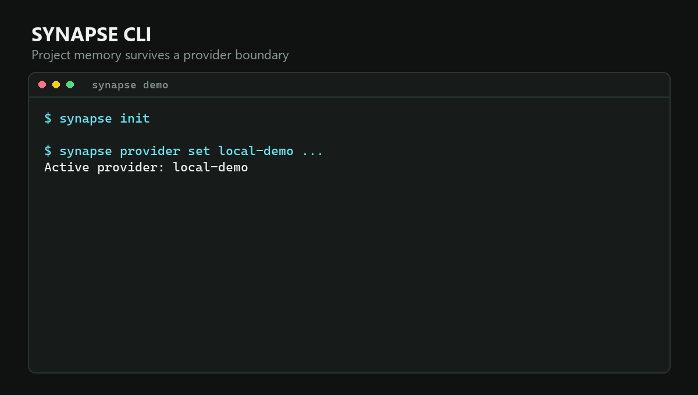
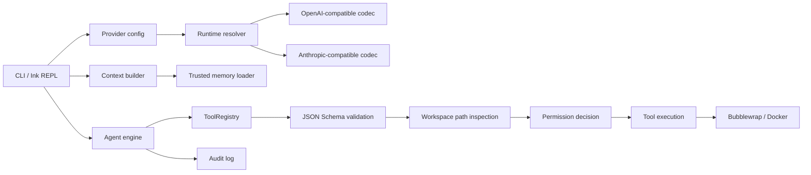

# Synapse CLI 项目案例

> 一个可切换模型供应商、保留本地项目记忆，并对高风险工具执行实行 Fail-closed 控制的 TypeScript 终端 Agent。

- GitHub: https://github.com/bandageok/synapse-cli
- npm: https://www.npmjs.com/package/@bandageok/synapse-cli
- 技术栈：TypeScript、Node.js、Ink、Vitest、AJV、Bubblewrap、Docker
- 当前阶段：早期开源版本，已完成公开安装、跨平台 CI 和安全边界测试



## 项目背景

不同模型和网关各自有认证、消息协议和工具调用格式。直接把业务逻辑写在某个 SDK 周围，会让更换模型同时影响会话、工具、记忆和错误处理。另一方面，Coding Agent 能够读写文件和执行命令，如果“自动模式”在隔离后端不可用时退回宿主 shell，便利性会直接变成安全风险。

Synapse 的目标不是再做一个只绑定单一厂商的聊天壳，而是把以下能力放在同一个可检查的 CLI 中：

1. 配置驱动的 Provider 路由；
2. 本地、分层、带信任边界的项目记忆；
3. 工具 Schema、路径、权限和沙箱组成的纵深防御；
4. 能在真实安装路径和多平台 CI 中复现的发布流程。

## 我的贡献边界

本案例只把 Git 历史中由 `BandageOK` 或 `bandageok` 署名、并且可以通过 diff 与测试解释的工作计入个人贡献。早期 `C.C.Claw` 提交不在本案例的个人贡献声明中，除非能够证明它是同一人的历史身份。

| 贡献 | 代表提交 | 可验证结果 |
| --- | --- | --- |
| Provider 与 Memory CLI 工程化 | `a59df02` | 配置驱动 Provider、Memory inspect/search/prune/export、CLI 与集成测试 |
| Node 18 / Linux 兼容与发布检查 | `e39818a`、`ee7cc74` | CI、Doctor、SemVer、跨平台依赖与命令修复 |
| Onboarding 和真实会话可测试性 | `0bbc297` | Onboarding flow/UI、conversation E2E、Provider 回归测试 |
| Agent 安全边界 | `cdc8944` | ToolRegistry、上下文信任、网络策略、沙箱、MCP 指纹、协议测试 |
| 严格沙箱运行修复 | `7667094`、`a3ffa94`、`5deb47b`、`01d9d62` | 真实 Bubblewrap/Docker 探测、网络隔离、工作区映射、E2E 失败可见性 |
| 公开发布面 | `457aee3` | README、中文文档、真实 Demo、社区模板、npm/GitHub Release |
| 来源整改与维护器替换 | `v0.3.2` | 删除未接入模块，重写 MemoryMaintenance/Vim，移除 Heartbeat shell 旁路，新增 ADR 与回归测试 |
| 产品身份与 Provider 边界 | `v0.3.3` | 固化 Synapse/BandageOK 产品归属，接入 IDENTITY.md，注入运行时路由并本地回答直接身份问题 |

开发过程中使用了 AI 编码工具辅助检索、实现和验证。项目陈述以代码、提交、测试和发布结果为准，不以“全部手写”作为卖点。

## 架构概览



核心原则是把 Provider、上下文和工具执行拆成不同边界。模型生成的工具名和参数始终是不可信输入，不能因为模型“已经决定执行”就绕过验证和授权。

## 关键设计一：Provider 路由

### 问题

“支持多个模型”不能只是在 UI 中增加几个固定选项。真实企业环境还会使用自建网关、本地模型、代理 BaseURL、不同认证头以及主备模型。

### 方案

`src/providers/management.ts` 将运行时配置归一化为：

- `protocol`: `openai` 或 `anthropic`；
- `auth`: `bearer` 或 `x-api-key`；
- `baseUrl`、`model`、`apiKeyEnv`；
- 最多八个去重后的 fallback model。

Preset 只是默认值，不决定运行时架构。自定义 Provider 经过同一套 URL、协议、认证和环境变量名校验，再由 `src/providers/factory.ts` 创建协议适配器。Provider codec 负责把内部中立的 tool use/tool result 转成对应协议，并保留 tool call id。

Fallback 只允许发生在主模型尚未输出任何内容时；一旦开始流式输出，切换 Provider 会造成重复或语义断裂，因此直接暴露错误。认证失败和请求格式错误也不会盲目重试到备用模型。

Provider 可替换也意味着产品身份不能由模型自行猜测。一次真实 DeepSeek 会话曾在追问开发者时错误自称 Claude。根因是系统提示只有产品名，没有开发者、运行时路由，也没有加载已经生成的 `IDENTITY.md`。整改后 Context 明确拆成三层：不可变的 `Synapse / BandageOK` 产品身份、可配置但低优先级的本地 Agent 档案、只读的 Provider/模型运行时事实。旧会话中的错误自述会被标记为历史错误，而不是继续成为上下文依据。

### 结果

- 更换 Provider 不修改 Engine、ToolRegistry 或 Memory；
- API key 只从环境变量或本地 `.env` 读取，列表输出不打印值；
- Provider test 使用有上限的真实请求，并区分超时、网络、认证、404 和限流错误。
- 身份回归测试直接检查发送给 Provider 的 system prompt，同时验证 Provider 名称中的换行不能注入新指令。

## 关键设计二：本地记忆

记忆系统分为加载、管理和维护三个职责：

1. `MemoryLoader` 从用户目录、项目层级、局部文件和 `.synapse/rules` 发现上下文；
2. `memory management` 提供 inspect、search、prune、export 和手动追加；
3. `MemoryMaintenance` 对根目录 `MEMORY.md` 做确定性的边界维护。

### 信任边界

项目 Markdown 不是系统权限。MemoryLoader 会：

- 拒绝绝对路径、`~` 路径、跨根目录 traversal 和符号链接逃逸；
- 限制 include 深度、文件数、单文件字符数和聚合字符数；
- 按从全局到项目局部的顺序加载，但始终放在不可覆盖安全内核的位置；
- 将仓库规则明确标记为潜在不可信上下文。

### 确定性维护

早期维护器操作了错误的 `memory/MEMORY.md` 路径，并保留了没有接入 Provider 的 Prompt 模块。整改后维护器直接处理实际注入的 `${SYNAPSE_DATA_DIR}/MEMORY.md`：

- 独占 lease 防止并发维护；
- 超时恢复陈旧 lease；
- 临时文件加 rename，避免半写状态；
- 保留标题和正文，只去重列表项、收缩空行并限制行数/UTF-8 字节数；
- 读取旧 `.dream-lock.json` 时间戳完成一次兼容迁移。

## 关键设计三：Fail-closed 工具边界

一次工具调用依次经过：

```text
registered tool
  -> JSON Schema validation
  -> workspace and sensitive-path inspection
  -> allow / ask / deny decision
  -> explicit human approval when required
  -> tool implementation
  -> strict sandbox when workspace-auto is enabled
```

关键点不是增加危险命令正则，而是任何关键前置条件缺失都拒绝执行：

- 权限注册表未初始化：deny；
- Tool Schema 不存在或参数不合法：deny；
- 路径逃出工作区或经过 symlink/junction 逃逸：deny；
- 写入、执行、网络和敏感文件读取：要求明确审批；
- `workspace-auto` 找不到可运行的 Bubblewrap/Docker：返回错误，不退回宿主 shell；
- MCP 命令、脚本内容或能力指纹变化：撤销信任；
- `HEARTBEAT.md` 中的代码块：只作为文本，不执行。

这套设计仍不是绝对安全保证。它是可测试的纵深防御，并明确承认宿主权限、容器配置和第三方依赖仍属于攻击面。

## 关键设计四：测试策略

测试按风险分层，而不是只验证命令输出：

- 单元测试：Parser、Provider 配置、Memory 维护、SemVer；
- 协议测试：流式 tool call 拼接、tool id、Provider fallback；
- 集成测试：CLI init/provider/memory/doctor、Onboarding、会话；
- 对抗测试：指令 include 逃逸、敏感路径、MCP 可执行文件替换；
- 运行时隔离测试：在 Linux CI 中真实启动 Bubblewrap 或 Docker，验证工作区写入、宿主路径隔离、网络隔离和 PID 可见性。

CI 使用 Windows 与 Ubuntu、Node.js 18 与 22 的矩阵，并执行 lint、全量测试、构建、pack dry-run 和 npm audit。严格沙箱单独作为 Linux 作业运行，避免用 mock 代替隔离证据。

## 一次重要的自我纠错

来源整改审查中发现 Heartbeat 可以把 `HEARTBEAT.md` 代码块直接交给 `execSync`。这条路径不经过 ToolRegistry，与 Fail-closed 声明矛盾。

修复没有选择“增加警告”，而是删除宿主 shell 执行能力，将 Heartbeat 收缩为纯进程内观察器，并增加一个写 marker 文件的恶意命令回归测试。这个问题说明安全审计必须检查所有进程创建点，而不是只看主工具注册表。

## 验证与发布

本地复现命令：

```bash
npm ci
npm run lint
npm test
npm run build
npm pack --dry-run
npm audit --omit=dev
node examples/demo/run-demo.mjs
```

Demo 使用本地确定性 OpenAI-compatible endpoint，不需要真实 API key，并验证项目记忆确实进入 Provider 请求。

## 限制与下一步

- 项目仍处于 `v1.0.0` 之前，命令和配置可能变化；
- macOS 没有进入当前 CI 矩阵；
- Windows 严格自动模式依赖可运行的 Docker；
- 当前外部采用数据不足，不把下载量等同于真实用户；
- 来源整改不删除 Git 历史，也不构成法律 clean-room 证明，详见 [ADR-0004](./adr/0004-provenance-remediation-and-maintenance.md)；
- 早期提交身份需要在求职材料中如实说明。

## 这个项目证明什么

Synapse 最有价值的不是功能数量，而是能够展示一条完整工程链：需求边界、协议抽象、权限设计、跨平台测试、真实沙箱验证、公开打包、回归修复和来源透明度。它适合证明 Developer Tools、AI Agent 应用工程和 TypeScript/Node.js 工程能力，不适合被包装成已有大规模用户的成熟商业产品。
